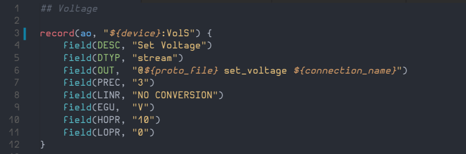

# vscode-epics

This VS Code extension provides syntax highlighting for EPICS database, template, substitutions and startup files, and streamdevice prototype files.

## Features

- [x] Syntax highlighting (mostly done)

- [ ] Snippets
- [ ] Compilation facilities

## Requirements

VS Code 1.5 or newer version.

## Extension Settings

None yet!

## Known Issues

Every field types are not recognized yet, only the more commons.

## Release Notes

### 0.0.1

Initial release of vscode-epics.
