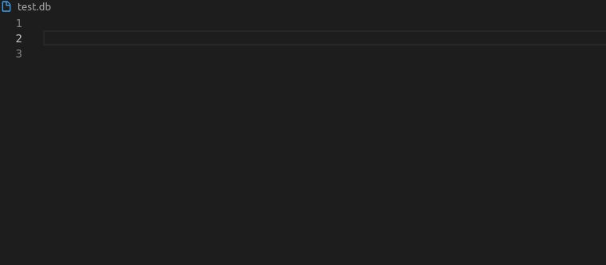

# [vscode-epics](https://marketplace.visualstudio.com/items?itemName=nsd.vscode-epics), EYE (Enlight Your Epics) <!-- omit in toc -->

This VS Code extension provides syntax highlighting for EPICS database, template, substitutions and startup files, and streamdevice prototype files.

- [1. Features](#1-features)
- [2. Requirements](#2-requirements)
- [3. get all the fields of the EPICS database](#3-get-all-the-fields-of-the-epics-database)
- [4. useful links](#4-useful-links)
- [5. create a new extension version](#5-create-a-new-extension-version)
- [7. create a gif for the documentation](#7-create-a-gif-for-the-documentation)
- [8. Extension Settings](#8-extension-settings)
- [9. Known Issues](#9-known-issues)
- [10. Credits](#10-credits)
- [11. to do](#11-to-do)

## 1. Features

- [x] Syntax highlighting for:
  - [x] database and template files (.db, .dbd and .template)
  - [x] substitutions files (.substitutions, .sub, and .subs)
  - [x] startup files (.cmd and .iocsh)
  - [x] streamdevice prototype files (.proto)
  - [x] SNL files (.st extensions are considered as .c extension and some keywords are highlighted)



- [ ] Snippets for:
  - [x] database and template files (.db and .template)
  - [x] substitutions files (.substitutions, .sub, and .subs)
  - [x] startup files (.cmd and .iocsh)
  - [x] C source code
  - [ ] streamdevice prototype files (.proto)
  - [x] SNL files (over charge of your .c extension)
  - [x] we-test (scenario and suite)

| Tips: to see all the available snippets per file type, write "epics." and a list will show up (file has to have a known extension). |
| --- |

- [ ] Compilation facilities

- [ ] Linter for:
  - [ ] database and template files
  - [ ] substitutions files
  - [ ] startup files
  - [ ] streamdevice prototype files
  - [ ] SNL files

## 2. Requirements

VS Code 1.5 or newer version.

## 3. get all the fields of the EPICS database

- "*.db*": to select .dbd and .dbd.pod files
- commun: 
```
$ cat <path_to_epics-base>/src/ioc/db/*.db*  | grep 'field(' | tr "(," " " | awk '{print $2}' | tr "\n" "|" | sed 's/.$//'
```
- specific:
```
$ cat <path_to_epics-base>/src/std/rec/*.db* | grep 'field(' | tr "(," " " | awk '{print $2}' | tr "\n" "|" | sed 's/.$//'
```

## 4. useful links
- extension [code source](https://github.com/NSenaud/vscode-epics)
- Extension on the vscode [marketplace](https://marketplace.visualstudio.com/items?itemName=nsd.vscode-epics)
- [create, run and debug an extension](https://code.visualstudio.com/api). Everithing is explained in [vsc-extension-quickstart.md](./vsc-extension-quickstart.md)
- snippets and highlight [information](https://code.visualstudio.com/api/language-extensions/syntax-highlight-guide#scope-inspector)
  - F1
  - Developer Inspect TM Scopes

## 5. create a new extension version
  1. commit changes and close corresponding github issues
  2. report in [downloadTracking.ods](./doc/downloadTracking.ods) the number of download with the date and the version
  3. update `CHANGELOG.md`
  4. check `README.md`
  5. check version in `package.json`
  6. create a package with vse: `$ vsce package # generate vsix file`
  7. create the git tag: `git tag -a x.x.x -m "..."`
  8. push to server `git push origin --tags`
  9. publish the extension on the vscode marketplace (rights are limited to @nsd and @vnadot)
     1.  [manually](https://marketplace.visualstudio.com/manage/publishers/nsd?noPrompt=true)
     2.  via [CLI](https://code.visualstudio.com/api/working-with-extensions/publishing-extension). I didn't manage to make it work yet, issue with the token "requires an Personal Access Token").
  10. post a message on the EPICS [techtalk)[https://epics.anl.gov/tech-talk/2020/msg01930.php]. You can do that by answering by email.

## 7. create a gif for the documentation
https://github.com/phw/peek

## 8. Extension Settings

None yet!

## 9. Known Issues

See [gitlab issues](https://github.com/epics-extensions/vscode-epics/issues).

## 10. Credits

- Snippets are mainly coming from [language-epics](https://github.com/mmllski/language-epics) Atom plugin, [agaget](https://github.com/agaget) and [vnadot](https://github.com/vnadot).
- get all the fields of the EPICS database trick is coming from [atzvetkov](https://gitlab.com/stephane.tzvetkov)
- thanks to the contributors:  
  - [Ivo Hanak](https://github.com/hanak) from Institute of Plasma Physics (IPP CAS)
  - [Jeong Han Lee](https://github.com/jeonghanlee) from the European Spallation Source ERIC (ESS)
  - [Jeremy L.](https://github.com/JJL772) from Stanford Linear Accelerator Center (SLAC)
  - [TimGuiteDiamond](https://github.com/TimGuiteDiamond) from the Diamond Light Source (DLS)

## 11. to do
- [issues](https://github.com/epics-extensions/vscode-epics/issues)
